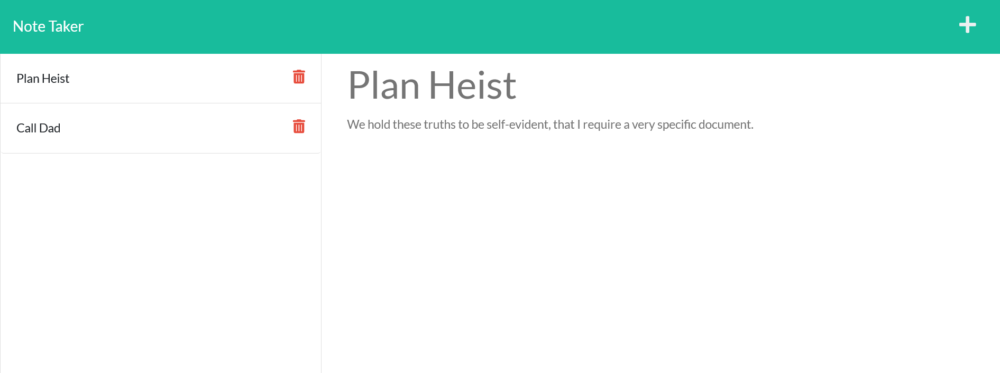

# Shiny Meme - A Note Take
A note taker to help people who are always making notes.

Description
====
A note taker that lets users write, save, and delete reminders.

To use, click the plus icon in the top-right and enter a note's name and description. A save icon will appear after editing any note and allow users to save their notes for future use. The delete button next to each note in the left pane will delete that note.

Demo
=====
Here's a live deployed version of the note taker: [https://shiny-meme-note-taker.herokuapp.com/](https://shiny-meme-note-taker.herokuapp.com/).

Credits
=====
__[Kurt Bixby](https://github.com/kurtbixby)__ wrote the backend ExpressJS routes. Other code and resources were provided by the UT Austin Boot Camp.

